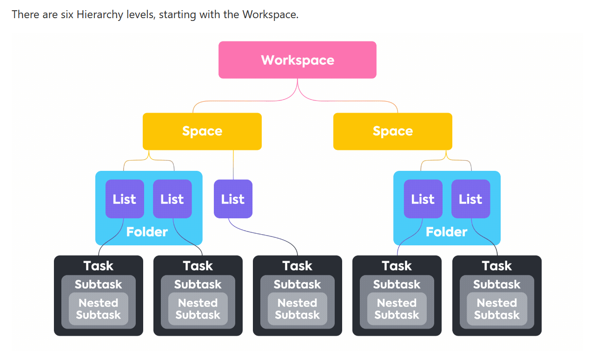
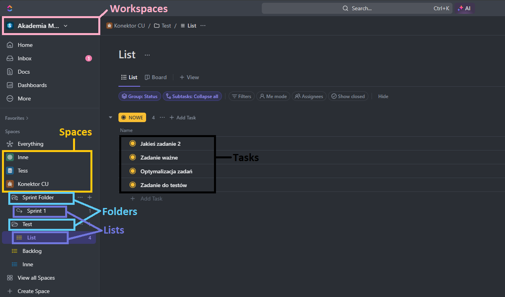
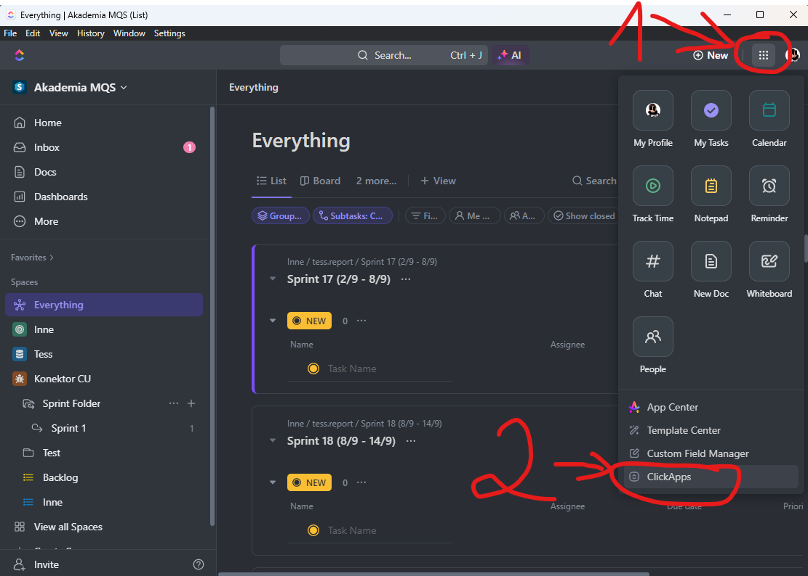
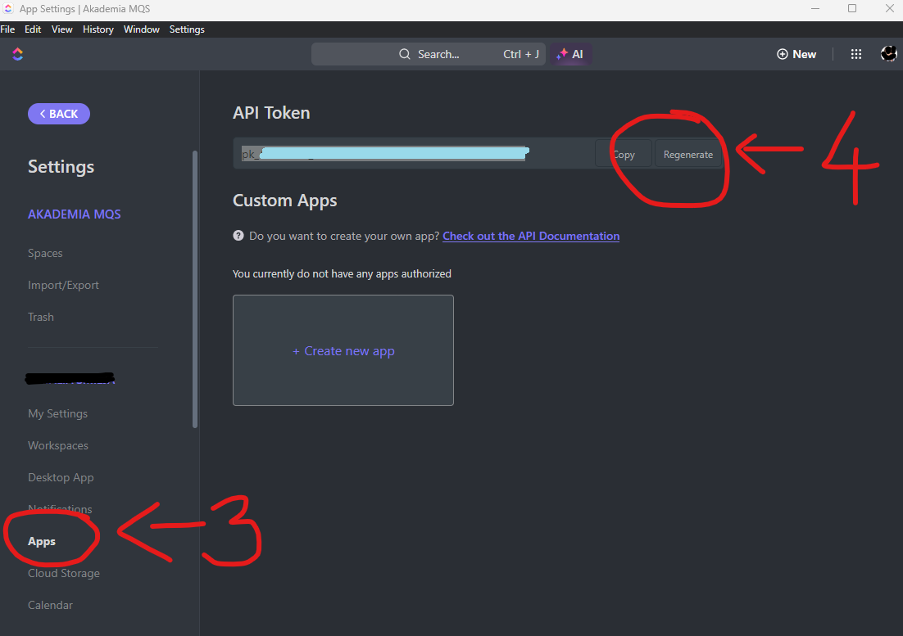
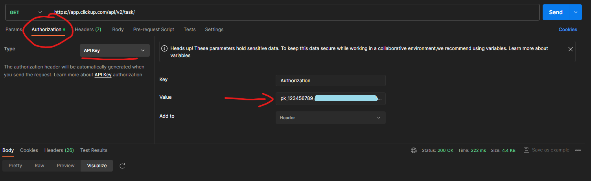

# Manual for using ClickUp API

## Introduction
To use the ClickUp API effectively, a good understanding of the CickUp Hierarchy and URL construction is required.
For official documentation see:
- https://help.clickup.com/hc/en-us
- https://clickup.com/api/

## ClickUp Hierarchy

Official documentation:
https://help.clickup.com/hc/en-us/articles/13856392825367-Intro-to-the-Hierarchy

In practice:

## Getting credentials
### Token

https://clickup.com/api/developer-portal/authentication/

## Using credentials
### Postman

### ClickUpAPI Class

Using ClickUp API via Python class ClickUpAPI requires token as an authentication key.
There are two ways of using token credentials in ClickUpAPI class:

    1. Setting credentials (token_value) at initiating class instance (required):

        instance_name = ClickUpAPI(token=token_value)

    An instance cannot be created without a token. Validation of token credentials is executed at request calls made at the use of class methods.
    Token used at instance initiation is a default token used in request header and therefore can be used to all class methods.

    2. Overriding token used for request header at each request made by selected instance methods (optional).

        instance_name.instance_method(token=new_token)

    User can easily change token value for each request method made through instance method if this method accepts token value as a parameter. If token parameter is not set, request will use token value used to initiate an instance.

## Methods based on ClickUp API

### ClickUp requests implemented
#### GET requests - implemented method
- GET Authorized Teams (Workspaces)     - get_authorized_teams_workspaces
- GET Authorized User                   - get_authorized_user
- GET Teams                             - get_teams
- GET Spaces                            - get_spaces
- GET Folders                           - get_folders
- GET Lists                             - get_lists
- GET Tasks                             - get_tasks
    - Note: custom_fields parameter not implemented
- GET Task                              - get_task
- GET User                              - get_user
- GET Time Entries Within a Date Range  - get_time_entries
- GET Task Comments                     - get_task_comments
- GET List Comments                     - get_list_comments
- GET Chat View Comments                - get_chat_view_comments
- GET Custom Task Types                 - get_custom_task_types
- GET Accessible Custom Fields          - get_accessible_custom_fields

### New methods for using ClikUp API requests
- user_worktime
    - Returns a dictionary of usernames with their time tracked from time entries request.
    Use 'assignee' parameter to designate users based on their IDs.
    Use 'team_id' parameter to indicate workspaces from which time tracked should be obtained.
    Use 'start_date' and 'end_date' parameters to select date range in which users were tracking time for their tasks.
- user_tasks
    - Returns a dictionary with the user's ('assignee') tasks.
    Use 'team_id' parameter to indicate workspaces from which tasks should be obtained.
    Use 'start_date' and 'end_date' parameters to select the time at which the tasks were conducted.
-

## ClickUp error messages
### Most common ClickUp errors returned while using API

    ECODE           Message/meaning
    ITEMV2_003      Internal server error - can be caused by incorrect data type or
                    incorrect value.
    LOC_008         Unsupported Entity - probably caused by using token with not high
                    enough credentials.
                    Try to use token with higher access or narrow down request by using
                    query parameters.
    OAUTH_017       Authorization header required.
    OAUTH_019       Oauth token not found - probably caused by using token with not high
                    enough credentials.
    OAUTH_027       A team (Workspace) was not authorized by the user for a particular
                    access token / invalid ID.
    OAUTH_040       Parameter must be an array (list or tuple) - at least two elements required
                    (empty string as a second element can solve the issue in case of filtering
                    by only one element in list/tuple).
    PUBAPITASK_008  Custom items must be an arra - also appears if list containsonly one element.
                    Add second element to solve the isssue. Second element can be anything
                    as long as it has correct data type (eg. str or int depending on requirements).
    PUBAPITASK_009  Custom items must be an array of numbers - some of list elementsare
                    of invalid type (integer required).
    SHARD_001       Incorrect data type (usually string input instead of an integer).
    TIMEENTRYM_006  Team not authorized - either user does not have required permissions
                    or 'team_id' (workspace) does not exist (invalid ID).
    TIMEENTRY_059   You have no access - use token with higher access permissions.
    TIMEENTRY_065   Only one hierarchy ID could be provided - more than one hierarchy
                    parameter was given to narrow search area (e.g. space_id with folder_id)
                    - use only one hierarchy parameter per search.
    ... to be continued ...
